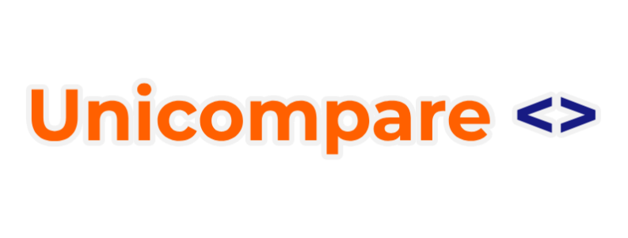

# UniCompare - University Records Comparison System

<p align="center">
<a href=""></a>
</p>

<p align="center">
<a href="docs/README_EN.md">English</a> | <a href="README.md">Portuguese</a>
</p>


## Description

UniCompare is a project developed as part of the Information Management course at Cesar School. This system allows users to perform basic CRUD (Create, Read, Update, Delete) operations on university records, such as course names and prices.

## Features

UniCompare offers the following features:

1. **Add Record:** Enables users to add new records, including the course name and price.

2. **Display Records (Sorted by Price):** Presents all existing records, sorted by price in ascending order.

3. **Update Record:** Allows the update of an existing record by providing the record's ID and the new data.

4. **Delete Record:** Permits the deletion of an existing record based on the provided ID.

## How to Run

Ensure you have Python installed on your system. Clone the repository and execute the `main.py` Python script in the command prompt.

```bash
python main.py
```

Follow the instructions in the prompt to interact with the system.

## Contributions

Contributions are welcome! If you encounter issues or have suggestions for improvement, please open an issue in this repository.

## Developers

- mxs2@cesar.school
- vrln2@cesar.school
- jhrbfl@cesar.school
- cfcl@cesar.school
- bag@cesar.school
- tmf2@cesar.school
- cjam@cesar.school

## License

This project is licensed under the MIT License - see the [LICENSE](LICENSE) file for details.

## Backlog
- [x] Do first prototype tests
- [ ] Do interviews 
- [ ] Fix database.txt empty line error 
- [ ] Fix database.txt Y variable error
- [ ] Add more data to database.txt 
